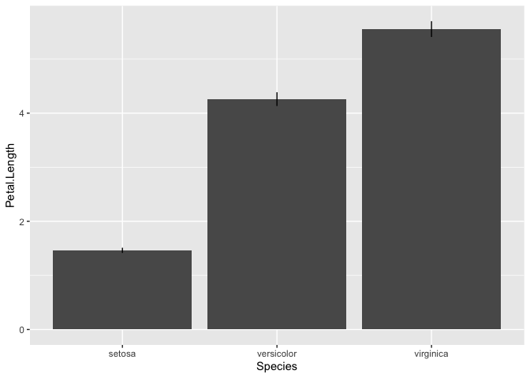
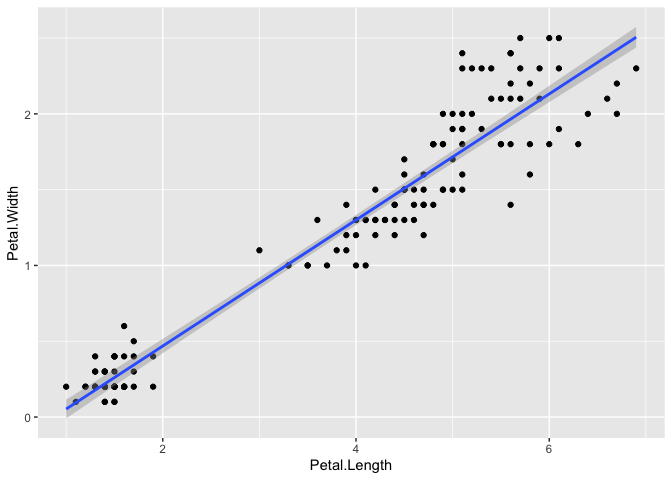
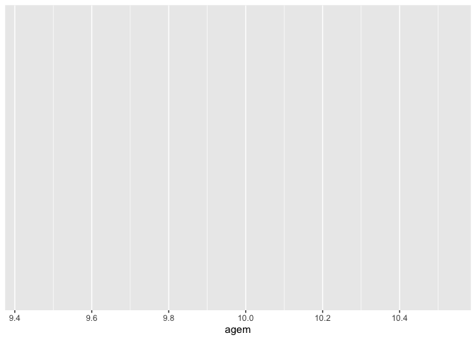
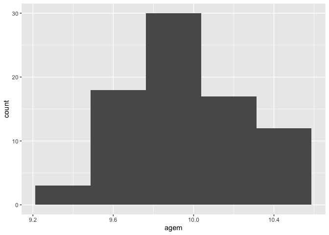
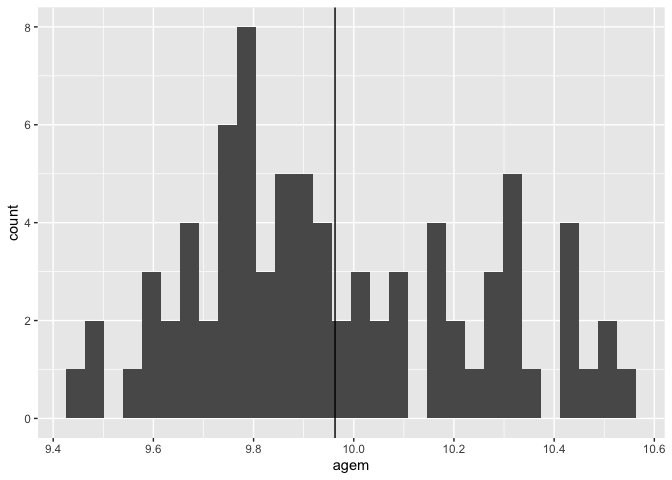
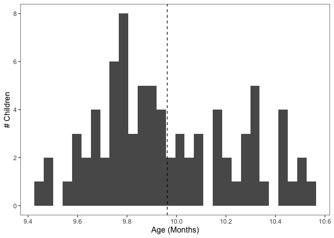
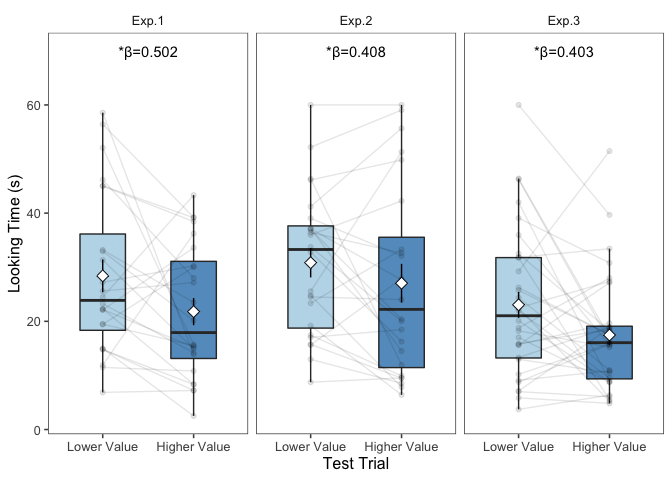

R Workshop
================
Natalia Vélez
7/9/2019

In this tutorial, we'll be analyzing data from a paper we've read recently, and we'll attempt to reproduce the main result. The *goal* of this tutorial is for you to use a real-world dataset to run through a typical workflow: we'll load data, clean the data, visualize the data, and run statistical tests on the results.

First, we'll load the libraries we'll use today:

``` r
library(tidyverse)
```

    ## ── Attaching packages ──────────────────────────────────────────────────────────────────────────────────────────── tidyverse 1.3.0 ──

    ## ✔ ggplot2 3.3.2     ✔ purrr   0.3.4
    ## ✔ tibble  3.0.1     ✔ dplyr   1.0.0
    ## ✔ tidyr   1.1.0     ✔ stringr 1.4.0
    ## ✔ readr   1.3.1     ✔ forcats 0.4.0

    ## Warning: package 'ggplot2' was built under R version 3.6.2

    ## Warning: package 'tibble' was built under R version 3.6.2

    ## Warning: package 'tidyr' was built under R version 3.6.2

    ## Warning: package 'purrr' was built under R version 3.6.2

    ## Warning: package 'dplyr' was built under R version 3.6.2

    ## ── Conflicts ─────────────────────────────────────────────────────────────────────────────────────────────── tidyverse_conflicts() ──
    ## ✖ dplyr::filter() masks stats::filter()
    ## ✖ dplyr::lag()    masks stats::lag()

``` r
library(broom.mixed)
```

    ## Warning: package 'broom.mixed' was built under R version 3.6.2

    ## Registered S3 methods overwritten by 'broom.mixed':
    ##   method         from 
    ##   augment.lme    broom
    ##   augment.merMod broom
    ##   glance.lme     broom
    ##   glance.merMod  broom
    ##   glance.stanreg broom
    ##   tidy.brmsfit   broom
    ##   tidy.gamlss    broom
    ##   tidy.lme       broom
    ##   tidy.merMod    broom
    ##   tidy.rjags     broom
    ##   tidy.stanfit   broom
    ##   tidy.stanreg   broom

``` r
library(ggthemes)
library(lme4)
```

    ## Loading required package: Matrix

    ## 
    ## Attaching package: 'Matrix'

    ## The following objects are masked from 'package:tidyr':
    ## 
    ##     expand, pack, unpack

``` r
library(lmerTest)
```

    ## 
    ## Attaching package: 'lmerTest'

    ## The following object is masked from 'package:lme4':
    ## 
    ##     lmer

    ## The following object is masked from 'package:stats':
    ## 
    ##     step

``` r
library(datasets)
```

If you learn nothing else today, learn this: Search!
----------------------------------------------------

We'll keep reminding you of this throughout today's workshop: search quickly, search often, and search in plain English (or your preferred non-computer language)!

### Use the internet!

Don't know what function you should use to do a t-test? Google "t test R", or "how do I do a t-test in R?". Don't remember how to use the chisq.test() function? Google "chisq.test() R". Don't remember what a chi-squared test is? Google it, and read the Wikipedia page, and the Stackexchange discussion, and whatever weird PDFs you find online. Still getting an error message when you try to run the code? Google that error message, in quotes.

Every person using R, and every person doing statistics, has a million questions as they are doing it - novices and experts alike. Luckily for all of us, many of our fellow R and stats learners post their questions online, and other lovely people attempt to answer them publicly! We read somewhere that a prominent distinction between an experienced programmer and a novice is the longer latency for the novice to look up the help for something confusing (but the direction of causality is not clear!).

### Use R!

Another wonderful thing about working in R is that there's actually a lot of help built right into R, and RStudio makes it very easy to see. Almost all R functions (more later on what those are) have help files built in that will provide you with useful information about what those functions do and how to use them. You find this by typing '?function', where I am using "function" as a stand-in for the name you actually want to know about (e.g., '?chisq.test' or '?t.test'). It's important to read these files closely the first time you encounter a function, but it's also (possibly more) important to refer to them **frequently**. If you have a sense for what you want to do, but don't know or can't remember the exact function that will do it, you can use two question marks to search through the help files for a term (e.g. '??regression').

### Debugging practice

Here are several chunks of code that are broken. Fix them! What tools are available to help you use to do this? We've included a note under each chunk about what we were **trying** to do :).

For these exercises, we'll use the [iris dataset](https://stat.ethz.ch/R-manual/R-devel/library/datasets/html/iris.html). This dataset gives measurements (in cm) of the sepal length, sepal width, and petal width for 50 flowers from each of 3 species of iris. Let's take a look at the data first:

``` r
head(iris)
```

    ##   Sepal.Length Sepal.Width Petal.Length Petal.Width Species
    ## 1          5.1         3.5          1.4         0.2  setosa
    ## 2          4.9         3.0          1.4         0.2  setosa
    ## 3          4.7         3.2          1.3         0.2  setosa
    ## 4          4.6         3.1          1.5         0.2  setosa
    ## 5          5.0         3.6          1.4         0.2  setosa
    ## 6          5.4         3.9          1.7         0.4  setosa

``` r
str(iris)
```

    ## 'data.frame':    150 obs. of  5 variables:
    ##  $ Sepal.Length: num  5.1 4.9 4.7 4.6 5 5.4 4.6 5 4.4 4.9 ...
    ##  $ Sepal.Width : num  3.5 3 3.2 3.1 3.6 3.9 3.4 3.4 2.9 3.1 ...
    ##  $ Petal.Length: num  1.4 1.4 1.3 1.5 1.4 1.7 1.4 1.5 1.4 1.5 ...
    ##  $ Petal.Width : num  0.2 0.2 0.2 0.2 0.2 0.4 0.3 0.2 0.2 0.1 ...
    ##  $ Species     : Factor w/ 3 levels "setosa","versicolor",..: 1 1 1 1 1 1 1 1 1 1 ...

``` r
summary(iris)
```

    ##   Sepal.Length    Sepal.Width     Petal.Length    Petal.Width   
    ##  Min.   :4.300   Min.   :2.000   Min.   :1.000   Min.   :0.100  
    ##  1st Qu.:5.100   1st Qu.:2.800   1st Qu.:1.600   1st Qu.:0.300  
    ##  Median :5.800   Median :3.000   Median :4.350   Median :1.300  
    ##  Mean   :5.843   Mean   :3.057   Mean   :3.758   Mean   :1.199  
    ##  3rd Qu.:6.400   3rd Qu.:3.300   3rd Qu.:5.100   3rd Qu.:1.800  
    ##  Max.   :7.900   Max.   :4.400   Max.   :6.900   Max.   :2.500  
    ##        Species  
    ##  setosa    :50  
    ##  versicolor:50  
    ##  virginica :50  
    ##                 
    ##                 
    ## 

**Exercise 1:** Get the last element of x

``` r
x = 25:90
tail(x, 1)
```

    ## [1] 90

**Exercise 2:** In the chunk below, I made a new dataframe, `avg_iris` that summarizes the average petal length for each species of iris. (Hint: you can enter `avg_iris` on the console to see what it looks like!) I want to use this dataframe to plot the average petal length for each species of iris—but it didn't work! Google the error and fix this code.

``` r
avg_iris = iris %>%
  group_by(Species) %>%
  summarise(avg_petal_length = mean(Petal.Length))

ggplot(avg_iris, aes(x = Species, y = avg_petal_length)) +
  geom_bar(stat='identity')
```

Slightly fancier version:

``` r
ggplot(iris, aes(x = Species, y = Petal.Length)) +
  stat_summary(fun.y = 'mean', geom = 'bar') +
  stat_summary(fun.data = 'mean_cl_boot', geom = 'errorbar', width = 0)
```

    ## Warning: `fun.y` is deprecated. Use `fun` instead.



**Exercise 3:** Here's a more general problem you will run into, simply, how to do something you've never done before! Below, we've plotted a scatter plot showing the relationship between petal length and petal width. Search Google to figure out how to add a regression line to this plot.

``` r
ggplot(iris, aes(x = Petal.Length, y = Petal.Width)) +
  geom_point() +
  geom_smooth(method = 'lm')
```

    ## `geom_smooth()` using formula 'y ~ x'



Data wrangling
--------------

First, let's load the data:

``` r
data_wide = read.csv('liu_deidentified_data.csv')
head(data_wide)
```

    ##   sex  subj agem experiment     cost hv_side first_fam first_test fam1
    ## 1   f S1_18 9.43      Exp.1 Barriers    left        HL         HV   60
    ## 2   f S1_16 9.63      Exp.1 Barriers   right        HL         HV   60
    ## 3   f  S1_3 9.70      Exp.1 Barriers   right        HL         HV   60
    ## 4   f S1_17 9.73      Exp.1 Barriers   right        LH         HV   60
    ## 5   m S1_11 9.80      Exp.1 Barriers    left        HL         HV   60
    ## 6   f  S1_8 9.80      Exp.1 Barriers   right        LH         HV   60
    ##   fam2  fam3  fam4  fam5  fam6 test1 test2 test3 test4 avg_fam sum_fam
    ## 1   60 37.77 60.00 54.53 12.20  20.6 54.48  9.27  8.19   47.42  284.50
    ## 2   60 60.00 60.00 60.00 38.72    60 41.59  16.9  48.4   56.45  338.72
    ## 3   60 60.00 60.00 18.18 10.70    60 60.00 18.46 52.83   44.81  268.88
    ## 4   60 60.00  4.78 60.00 10.76 12.44 13.50    60 10.31   42.59  255.54
    ## 5   60 48.73 60.00 29.89 36.65 52.47 18.15 34.18 30.82   49.21  295.27
    ## 6   60 55.23 60.00 60.00 60.00  3.31 12.66  1.71 17.33   59.21  355.23
    ##   avg_lv avg_hv   lv1   lv2   hv1   hv2  prop.lv  prop.hv pref.raw
    ## 1  31.34  14.94 54.48  8.19 20.60  9.27 0.597349 0.402651       LV
    ## 2  45.00  38.45 41.59 48.40 60.00 16.90 0.575293 0.424707       LV
    ## 3  56.42  39.23 60.00 52.83 60.00 18.46 0.620529 0.379471       LV
    ## 4  11.91  36.22 13.50 10.31 12.44 60.00 0.333534 0.666466       HV
    ## 5  24.49  43.33 18.15 30.82 52.47 34.18 0.365582 0.634418       HV
    ## 6  15.00   2.51 12.66 17.33  3.31  1.71 0.851463 0.148537       LV

### Summarizing data

We'll use the `group_by` and `summarise` functions to get a quick glance at our data. The `group_by` function splits your dataframe into groups based on values of a factor. `summarise` reduces values within each group down to a single value. You can use the two together to count values within your data frame, to compute averages, etc.

1.  How many babies participated *in each experiment*? (Note: The `n()` function is special; it returns the number of rows within each group. Since this dataset is in *wide* format, each child's data takes up one row; therefore, counting the number of rows gives us the number of children in each group.)

``` r
data_wide %>%
  group_by(experiment) %>%
  summarise(n = n())
```

    ## `summarise()` ungrouping output (override with `.groups` argument)

    ## # A tibble: 3 x 2
    ##   experiment     n
    ##   <fct>      <int>
    ## 1 Exp.1         24
    ## 2 Exp.2         24
    ## 3 Exp.3         32

1.  What are the minimum, maximum, and average ages of the babies who participated *across all experiments*? (Note: You can pass multiple functions through the `summarise` function to summarize different aspects of your data.)

``` r
data_wide %>%
  group_by(experiment) %>%
  summarise(n = n(),
            mean_age = mean(agem),
            sd_age = sd(agem))
```

    ## `summarise()` ungrouping output (override with `.groups` argument)

    ## # A tibble: 3 x 4
    ##   experiment     n mean_age sd_age
    ##   <fct>      <int>    <dbl>  <dbl>
    ## 1 Exp.1         24     9.95  0.292
    ## 2 Exp.2         24     9.88  0.237
    ## 3 Exp.3         32    10.0   0.294

1.  How many male and female babies participated *across all experiments*?

``` r
data_wide %>%
  group_by(sex) %>%
  summarise(n = n())
```

    ## `summarise()` ungrouping output (override with `.groups` argument)

    ## # A tibble: 2 x 2
    ##   sex       n
    ##   <fct> <int>
    ## 1 f        45
    ## 2 m        35

1.  *Challenge:* How many male and female babies participated in each experiment? (Hint: Take a look at the code chunks above and combine them!)

``` r
# I'm a comment! 
data_wide %>% 
  group_by(experiment, sex) %>% 
  summarise(n = n()) %>%
  spread(sex, n)
```

    ## `summarise()` regrouping output by 'experiment' (override with `.groups` argument)

    ## # A tibble: 3 x 3
    ## # Groups:   experiment [3]
    ##   experiment     f     m
    ##   <fct>      <int> <int>
    ## 1 Exp.1         15     9
    ## 2 Exp.2         15     9
    ## 3 Exp.3         15    17

### Cleaning up data

This is often the hardest part of analyzing your data! In order to answer questions about your data, you'll first have to get your data into the right format. The data we looked at above is in *wide* format: each child's data occupies one row, and each row contains multiple observations of a single child. We want to put the data in *tidy* format: each observation occupies one row. Most of the tools we'll use within the tidyverse are built to wrangle data into tidy format or to process tidy data (hence the name!).

#### Step 1: Make sure everything's the correct data type (str, mutate, mutate\_at)

For our analysis, we'll focus on looking times in the test trials: `test1`, `test2`, `test3`, `test4`. If we look at `data_wide`, we can see that R parsed some of these these as factors:

``` r
str(data_wide)
```

    ## 'data.frame':    80 obs. of  29 variables:
    ##  $ sex       : Factor w/ 2 levels "f","m": 1 1 1 1 2 1 1 2 2 1 ...
    ##  $ subj      : Factor w/ 80 levels "S1_1","S1_10",..: 10 8 18 9 3 23 7 19 16 5 ...
    ##  $ agem      : num  9.43 9.63 9.7 9.73 9.8 ...
    ##  $ experiment: Factor w/ 3 levels "Exp.1","Exp.2",..: 1 1 1 1 1 1 1 1 1 1 ...
    ##  $ cost      : Factor w/ 3 levels "Barriers","Gap",..: 1 1 1 1 1 1 1 1 1 1 ...
    ##  $ hv_side   : Factor w/ 2 levels "left","right": 1 2 2 2 1 2 1 1 1 2 ...
    ##  $ first_fam : Factor w/ 2 levels "HL","LH": 1 1 1 2 1 2 2 2 2 2 ...
    ##  $ first_test: Factor w/ 2 levels "HV","LV": 1 1 1 1 1 1 1 1 1 1 ...
    ##  $ fam1      : num  60 60 60 60 60 ...
    ##  $ fam2      : num  60 60 60 60 60 ...
    ##  $ fam3      : num  37.8 60 60 60 48.7 ...
    ##  $ fam4      : num  60 60 60 4.78 60 ...
    ##  $ fam5      : num  54.5 60 18.2 60 29.9 ...
    ##  $ fam6      : num  12.2 38.7 10.7 10.8 36.6 ...
    ##  $ test1     : Factor w/ 66 levels "11.1","11.17",..: 15 62 62 3 56 31 33 6 64 63 ...
    ##  $ test2     : num  54.5 41.6 60 13.5 18.1 ...
    ##  $ test3     : Factor w/ 75 levels "1.71","10.92",..: 69 14 20 56 36 1 75 9 24 74 ...
    ##  $ test4     : Factor w/ 70 levels "10.24","10.31",..: 61 39 44 2 28 14 NA 21 19 NA ...
    ##  $ avg_fam   : num  47.4 56.5 44.8 42.6 49.2 ...
    ##  $ sum_fam   : num  284 339 269 256 295 ...
    ##  $ avg_lv    : num  31.3 45 56.4 11.9 24.5 ...
    ##  $ avg_hv    : num  14.9 38.5 39.2 36.2 43.3 ...
    ##  $ lv1       : num  54.5 41.6 60 13.5 18.1 ...
    ##  $ lv2       : num  8.19 48.4 52.83 10.31 30.82 ...
    ##  $ hv1       : num  20.6 60 60 12.4 52.5 ...
    ##  $ hv2       : num  9.27 16.9 18.46 60 34.18 ...
    ##  $ prop.lv   : num  0.597 0.575 0.621 0.334 0.366 ...
    ##  $ prop.hv   : num  0.403 0.425 0.379 0.666 0.634 ...
    ##  $ pref.raw  : Factor w/ 2 levels "HV","LV": 2 2 2 1 1 2 1 2 2 1 ...

We want all of these two be processed as numerics, instead. We'll use the `mutate` function to change these variables! We want to first change each of these values to a string ("13.1" --&gt; "13.1") and then change the strings to a numeric ("13.1" --&gt; 13.1). (There's no good reason for this; this has to do with how R handles factors, and is the source of many errors and headaches in data analysis. Ask me to explain it!)

We could mutate each of these columns individually:

``` r
# Helper function
fctr_to_numeric = function(x_fctr) {
  x_num = as.numeric(as.character(x_fctr))
  return(x_num)
}

data_tidy = data_wide %>%
  mutate(test1 = fctr_to_numeric(test1),
         test2 = fctr_to_numeric(test2),
         test3 = fctr_to_numeric(test3),
         test4 = fctr_to_numeric(test4))
```

    ## Warning in fctr_to_numeric(test1): NAs introduced by coercion

    ## Warning in fctr_to_numeric(test3): NAs introduced by coercion

    ## Warning in fctr_to_numeric(test4): NAs introduced by coercion

``` r
str(data_tidy)
```

    ## 'data.frame':    80 obs. of  29 variables:
    ##  $ sex       : Factor w/ 2 levels "f","m": 1 1 1 1 2 1 1 2 2 1 ...
    ##  $ subj      : Factor w/ 80 levels "S1_1","S1_10",..: 10 8 18 9 3 23 7 19 16 5 ...
    ##  $ agem      : num  9.43 9.63 9.7 9.73 9.8 ...
    ##  $ experiment: Factor w/ 3 levels "Exp.1","Exp.2",..: 1 1 1 1 1 1 1 1 1 1 ...
    ##  $ cost      : Factor w/ 3 levels "Barriers","Gap",..: 1 1 1 1 1 1 1 1 1 1 ...
    ##  $ hv_side   : Factor w/ 2 levels "left","right": 1 2 2 2 1 2 1 1 1 2 ...
    ##  $ first_fam : Factor w/ 2 levels "HL","LH": 1 1 1 2 1 2 2 2 2 2 ...
    ##  $ first_test: Factor w/ 2 levels "HV","LV": 1 1 1 1 1 1 1 1 1 1 ...
    ##  $ fam1      : num  60 60 60 60 60 ...
    ##  $ fam2      : num  60 60 60 60 60 ...
    ##  $ fam3      : num  37.8 60 60 60 48.7 ...
    ##  $ fam4      : num  60 60 60 4.78 60 ...
    ##  $ fam5      : num  54.5 60 18.2 60 29.9 ...
    ##  $ fam6      : num  12.2 38.7 10.7 10.8 36.6 ...
    ##  $ test1     : num  20.6 60 60 12.4 52.5 ...
    ##  $ test2     : num  54.5 41.6 60 13.5 18.1 ...
    ##  $ test3     : num  9.27 16.9 18.46 60 34.18 ...
    ##  $ test4     : num  8.19 48.4 52.83 10.31 30.82 ...
    ##  $ avg_fam   : num  47.4 56.5 44.8 42.6 49.2 ...
    ##  $ sum_fam   : num  284 339 269 256 295 ...
    ##  $ avg_lv    : num  31.3 45 56.4 11.9 24.5 ...
    ##  $ avg_hv    : num  14.9 38.5 39.2 36.2 43.3 ...
    ##  $ lv1       : num  54.5 41.6 60 13.5 18.1 ...
    ##  $ lv2       : num  8.19 48.4 52.83 10.31 30.82 ...
    ##  $ hv1       : num  20.6 60 60 12.4 52.5 ...
    ##  $ hv2       : num  9.27 16.9 18.46 60 34.18 ...
    ##  $ prop.lv   : num  0.597 0.575 0.621 0.334 0.366 ...
    ##  $ prop.hv   : num  0.403 0.425 0.379 0.666 0.634 ...
    ##  $ pref.raw  : Factor w/ 2 levels "HV","LV": 2 2 2 1 1 2 1 2 2 1 ...

Or, if you want to be fancy: we could select all the variables that start with the string "test" (`vars(starts_with('test'))`) and change them all at once using `mutate_at`:

``` r
data_tidy = data_wide %>%
  mutate_at(vars(starts_with('test')), fctr_to_numeric)
```

    ## Warning in (function (x_fctr) : NAs introduced by coercion

    ## Warning in (function (x_fctr) : NAs introduced by coercion

    ## Warning in (function (x_fctr) : NAs introduced by coercion

Now, let's do some *quality checks!* First, let's make sure that these columns are now numeric:

``` r
str(data_tidy)
```

    ## 'data.frame':    80 obs. of  29 variables:
    ##  $ sex       : Factor w/ 2 levels "f","m": 1 1 1 1 2 1 1 2 2 1 ...
    ##  $ subj      : Factor w/ 80 levels "S1_1","S1_10",..: 10 8 18 9 3 23 7 19 16 5 ...
    ##  $ agem      : num  9.43 9.63 9.7 9.73 9.8 ...
    ##  $ experiment: Factor w/ 3 levels "Exp.1","Exp.2",..: 1 1 1 1 1 1 1 1 1 1 ...
    ##  $ cost      : Factor w/ 3 levels "Barriers","Gap",..: 1 1 1 1 1 1 1 1 1 1 ...
    ##  $ hv_side   : Factor w/ 2 levels "left","right": 1 2 2 2 1 2 1 1 1 2 ...
    ##  $ first_fam : Factor w/ 2 levels "HL","LH": 1 1 1 2 1 2 2 2 2 2 ...
    ##  $ first_test: Factor w/ 2 levels "HV","LV": 1 1 1 1 1 1 1 1 1 1 ...
    ##  $ fam1      : num  60 60 60 60 60 ...
    ##  $ fam2      : num  60 60 60 60 60 ...
    ##  $ fam3      : num  37.8 60 60 60 48.7 ...
    ##  $ fam4      : num  60 60 60 4.78 60 ...
    ##  $ fam5      : num  54.5 60 18.2 60 29.9 ...
    ##  $ fam6      : num  12.2 38.7 10.7 10.8 36.6 ...
    ##  $ test1     : num  20.6 60 60 12.4 52.5 ...
    ##  $ test2     : num  54.5 41.6 60 13.5 18.1 ...
    ##  $ test3     : num  9.27 16.9 18.46 60 34.18 ...
    ##  $ test4     : num  8.19 48.4 52.83 10.31 30.82 ...
    ##  $ avg_fam   : num  47.4 56.5 44.8 42.6 49.2 ...
    ##  $ sum_fam   : num  284 339 269 256 295 ...
    ##  $ avg_lv    : num  31.3 45 56.4 11.9 24.5 ...
    ##  $ avg_hv    : num  14.9 38.5 39.2 36.2 43.3 ...
    ##  $ lv1       : num  54.5 41.6 60 13.5 18.1 ...
    ##  $ lv2       : num  8.19 48.4 52.83 10.31 30.82 ...
    ##  $ hv1       : num  20.6 60 60 12.4 52.5 ...
    ##  $ hv2       : num  9.27 16.9 18.46 60 34.18 ...
    ##  $ prop.lv   : num  0.597 0.575 0.621 0.334 0.366 ...
    ##  $ prop.hv   : num  0.403 0.425 0.379 0.666 0.634 ...
    ##  $ pref.raw  : Factor w/ 2 levels "HV","LV": 2 2 2 1 1 2 1 2 2 1 ...

Now, let's make sure that we didn't accidentally change anything when we converted these columns, by comparing the first few rows of our original dataframe (`data_wide`) to our new dataframe (`data_tidy`):

``` r
data_wide %>% select(starts_with("test")) %>% head()
```

    ##   test1 test2 test3 test4
    ## 1  20.6 54.48  9.27  8.19
    ## 2    60 41.59  16.9  48.4
    ## 3    60 60.00 18.46 52.83
    ## 4 12.44 13.50    60 10.31
    ## 5 52.47 18.15 34.18 30.82
    ## 6  3.31 12.66  1.71 17.33

``` r
data_tidy %>% select(starts_with("test")) %>% head()
```

    ##   test1 test2 test3 test4
    ## 1 20.60 54.48  9.27  8.19
    ## 2 60.00 41.59 16.90 48.40
    ## 3 60.00 60.00 18.46 52.83
    ## 4 12.44 13.50 60.00 10.31
    ## 5 52.47 18.15 34.18 30.82
    ## 6  3.31 12.66  1.71 17.33

#### Step 2: Select the columns you want to analyze (select, select\_helpers)

`data_wide` contains many, many columns, which describe:

-   Participant information (`sex`, `subj`, `agem`)
-   Counterbalancing information (`experiment`, `cost`, `hv_side`, `first_fam`, `first_test`)
-   Looking time in familiarization trials (`fam*`)
-   Looking time in test trials (`test*`)
-   Summary statistics of looking times (`avg_fam`-`pref.raw`)

For our analysis, we just want to keep columns relating to participant information, counterbaslancing, and test trials. We're going to use the `select` function to keep just these columns!

`select` has lots of helper functions that make it easier to pick out the columsn you want. You can learn more about these by looking at the documentation:

``` r
?select_helpers
```

    ## Help on topic 'select_helpers' was found in the following
    ## packages:
    ## 
    ##   Package               Library
    ##   tidyselect            /Library/Frameworks/R.framework/Versions/3.6/Resources/library
    ##   dplyr                 /Library/Frameworks/R.framework/Versions/3.6/Resources/library
    ##   tidyr                 /Library/Frameworks/R.framework/Versions/3.6/Resources/library
    ## 
    ## 
    ## Using the first match ...

You can also use slice notation (\[start\_col\]:\[end\_col\]) to select a range of contiguous columns. We're going to use a combination of slicing and a helper function (`starts_with`) to select the columns we want:

``` r
data_tidy = data_tidy %>%
  select(sex:first_test, starts_with('test'))

str(data_tidy)
```

    ## 'data.frame':    80 obs. of  12 variables:
    ##  $ sex       : Factor w/ 2 levels "f","m": 1 1 1 1 2 1 1 2 2 1 ...
    ##  $ subj      : Factor w/ 80 levels "S1_1","S1_10",..: 10 8 18 9 3 23 7 19 16 5 ...
    ##  $ agem      : num  9.43 9.63 9.7 9.73 9.8 ...
    ##  $ experiment: Factor w/ 3 levels "Exp.1","Exp.2",..: 1 1 1 1 1 1 1 1 1 1 ...
    ##  $ cost      : Factor w/ 3 levels "Barriers","Gap",..: 1 1 1 1 1 1 1 1 1 1 ...
    ##  $ hv_side   : Factor w/ 2 levels "left","right": 1 2 2 2 1 2 1 1 1 2 ...
    ##  $ first_fam : Factor w/ 2 levels "HL","LH": 1 1 1 2 1 2 2 2 2 2 ...
    ##  $ first_test: Factor w/ 2 levels "HV","LV": 1 1 1 1 1 1 1 1 1 1 ...
    ##  $ test1     : num  20.6 60 60 12.4 52.5 ...
    ##  $ test2     : num  54.5 41.6 60 13.5 18.1 ...
    ##  $ test3     : num  9.27 16.9 18.46 60 34.18 ...
    ##  $ test4     : num  8.19 48.4 52.83 10.31 30.82 ...

#### Step 3: Tidy the data (gather, arrange)

The `gather` function "gathers" multiple columns in a wide data frame and converts them to key-value pairs in a tidy dataframe. Let's try this with a simple dataframe to test it out:

``` r
foo = data_frame(subject = 'demo', trial1 = 1, trial2 = 2, trial3 = 3, trial4 = 4)
```

    ## Warning: `data_frame()` is deprecated as of tibble 1.1.0.
    ## Please use `tibble()` instead.
    ## This warning is displayed once every 8 hours.
    ## Call `lifecycle::last_warnings()` to see where this warning was generated.

``` r
foo
```

    ## # A tibble: 1 x 5
    ##   subject trial1 trial2 trial3 trial4
    ##   <chr>    <dbl>  <dbl>  <dbl>  <dbl>
    ## 1 demo         1      2      3      4

``` r
bar = foo %>% gather(trial, response, trial1:trial4)
bar
```

    ## # A tibble: 4 x 3
    ##   subject trial  response
    ##   <chr>   <chr>     <dbl>
    ## 1 demo    trial1        1
    ## 2 demo    trial2        2
    ## 3 demo    trial3        3
    ## 4 demo    trial4        4

``` r
bar %>% spread(trial, response)
```

    ## # A tibble: 1 x 5
    ##   subject trial1 trial2 trial3 trial4
    ##   <chr>    <dbl>  <dbl>  <dbl>  <dbl>
    ## 1 demo         1      2      3      4

Let's do the same to our actual data! We're also going to use the `arrange` function to sort the dataframe by experiment, subject, and trial, which will make it easier to manually inspect:

``` r
data_tidy = data_tidy %>%
  gather(trial, look, test1:test4) %>%
  arrange(experiment, subj, trial)

head(data_tidy)
```

    ##   sex  subj agem experiment     cost hv_side first_fam first_test trial
    ## 1   m  S1_1 10.5      Exp.1 Barriers    left        HL         HV test1
    ## 2   m  S1_1 10.5      Exp.1 Barriers    left        HL         HV test2
    ## 3   m  S1_1 10.5      Exp.1 Barriers    left        HL         HV test3
    ## 4   m  S1_1 10.5      Exp.1 Barriers    left        HL         HV test4
    ## 5   f S1_10  9.9      Exp.1 Barriers    left        LH         LV test1
    ## 6   f S1_10  9.9      Exp.1 Barriers    left        LH         LV test2
    ##    look
    ## 1 32.80
    ## 2  6.38
    ## 3 14.20
    ## 4 60.00
    ## 5 54.04
    ## 6 20.82

#### Step 4: Label each trial type (mutate, ifelse)

(Note: This step is pretty idiosyncratic to this particular dataset! This is one of the most challenging parts with working with other people's data: Everyone organizes their data in their own way. Thankfully, this particular dataset is very organized and well documented, so we can use what we know from the paper and codebook to tidy the data.)

We have almost everything we need to analyze the data! Now we just need to label each trial as either as "high value" or "low value" trial. The dataset has one column that will help us do this: `first_test`. Here, we have to read the paper to learn how the trials were counterbalanced. From the paper, we know the following:

-   There are two types of test trials, where the agent approaches the high-value \[HV\] or low-value \[LV\] target
-   Each child saw four test trials total
-   Test trials were presented in an alternating order
-   The experimenters counterbalanced which trial was shown first

If we put all these together, we now know that, if the first test trial is "LV", then the trial order is "LV-HV-LV-HV" and that, if the first test trial is "HV", then the trial order is "HV-LV-HV-LV".

Let's use what we know to label the trials:

``` r
data_tidy = data_tidy %>%
  group_by(subj) %>%
  mutate(trial_no = str_extract(trial, '(?<=test)[1-4]'),
         trial_no = as.numeric(trial_no),
         trial_type = ifelse(first_test == 'HV',
                             c('HV', 'LV', 'HV', 'LV'),
                             c('LV', 'HV', 'LV', 'HV')),
         trial_type = factor(trial_type,
                             levels = c('LV', 'HV'),
                             labels = c('Lower Value', 'Higher Value'))) %>%
  select(-starts_with("first"))

data_tidy
```

    ## # A tibble: 320 x 10
    ## # Groups:   subj [80]
    ##    sex   subj   agem experiment cost  hv_side trial  look trial_no
    ##    <fct> <fct> <dbl> <fct>      <fct> <fct>   <chr> <dbl>    <dbl>
    ##  1 m     S1_1   10.5 Exp.1      Barr… left    test1 32.8         1
    ##  2 m     S1_1   10.5 Exp.1      Barr… left    test2  6.38        2
    ##  3 m     S1_1   10.5 Exp.1      Barr… left    test3 14.2         3
    ##  4 m     S1_1   10.5 Exp.1      Barr… left    test4 60           4
    ##  5 f     S1_10   9.9 Exp.1      Barr… left    test1 54.0         1
    ##  6 f     S1_10   9.9 Exp.1      Barr… left    test2 20.8         2
    ##  7 f     S1_10   9.9 Exp.1      Barr… left    test3 11.8         3
    ##  8 f     S1_10   9.9 Exp.1      Barr… left    test4 19.5         4
    ##  9 m     S1_11   9.8 Exp.1      Barr… left    test1 52.5         1
    ## 10 m     S1_11   9.8 Exp.1      Barr… left    test2 18.2         2
    ## # … with 310 more rows, and 1 more variable: trial_type <fct>

Visualizing data (ggplot)
-------------------------

Phew, we made it! Now we have everything we need to reproduce the main figure in the plot. Hooray, science!

### Introduction to ggplot

First, let's learn the basics of ggplot. We'll build a plot by taking a sequence of commands and combining them using +. Each command controls one aspect of the appearance of our plot.

The basic building block of our plot is the `ggplot` command. Here, we'll specify two important things about our plot:

-   `data`: What dataset we're using
-   `aes`: Aesthetic mappings (i.e., which columns in the dataframe map onto which aspects of the plot; the most basic of these is setting variables for our x- and y-axes)

Let's try it! We're going to plot a histogram of babies' ages in our sample. To plot a histogram, we only have to specify a single aesthetic: which variable goes in our x axis.

``` r
ggplot(data_wide, aes(x = agem))
```



But wait—there's nothing on this plot yet! You can add graphics to this plot using *geoms*. There are many kinds of geoms. Some of the most common are: `geom_bar` (bars), `geom_point` (points), `geom_line` (lines), `geom_smooth` (regression fits), `geom_errorbar` (errorbars), and `geom_boxplot` (boxplots). Here, we're going to use `geom_histogram`.

``` r
ggplot(data_wide, aes(x = agem)) +
  geom_histogram(bins = 5)
```

 Ta-da! ggplot automatically split participants into bins and plotted the number of participants in each bin.

You can layer geoms on top of one another to build more complex plots. You can even build plots that use multiple dataframes: Here, I'm going to make a new dataframe, `mean_age`, that contains the average age across all experiments:

``` r
mean_age = data_wide %>%
  summarise(mean_age = mean(agem))

mean_age
```

    ##   mean_age
    ## 1 9.962625

And I'm going to use this dataframe to draw a vertical line (`geom_vline`) that marks the average age:

``` r
ggplot(data_wide, aes(x = agem)) +
  geom_histogram() +
  geom_vline(data=mean_age, aes(xintercept = mean_age))
```

    ## `stat_bin()` using `bins = 30`. Pick better value with `binwidth`.



Finally, I can use all kinds of options to customize the look of my plot:

``` r
ggplot(data_wide, aes(x = agem)) +
  geom_histogram() +
  geom_vline(data=mean_age, aes(xintercept = mean_age), linetype='dashed') +
  theme_few(base_size = 12) +
  xlab('Age (Months)') +
  ylab('# Children')
```

    ## `stat_bin()` using `bins = 30`. Pick better value with `binwidth`.



### Reproducing the main figure

Let's put this all together to plot the main figure in the paper. Remember, the end result looks like this:

![**Fig. 3. Boxplots of average looking time toward the higher- and lower-value choice during test in experiments 1 through 3.** White diamonds indicate means, with error bars indicating within-subjects standard errors. Horizontal lines indicate medians, boxes indicate middle quartiles, and whiskers indicate points within 1.5 times the interquartile range from the upper and lower edges of the middle quartiles. Light gray points connected across boxes indicate looking times from individual participants. Beta coefficients indicate effect sizes in standard deviations, and asterisks indicate significance relative to prespecified (experiments 1 and 2) and preregistered (experiment 3) alphas (\*P &lt; 0.05). Statistical analyses are provided in the text and supplementary materials.](images/liu_fig3.png)

This gives us a pretty good sense of what we need to plot! Based on the figure caption, we know that we need to prepare three things to make our plot.

First, we need to average across the trial types for each subject. (Remember, each baby completed two test trials/ type; by averaging across these two trials, we'll ensure that each baby contributes a single datapoint to each box.)

``` r
avg_subject_lt = data_tidy %>%
  group_by(experiment, subj, trial_type) %>%
  summarise(avg_look = mean(look, na.rm=T)) %>%
  mutate(log_look = log(avg_look))
```

    ## `summarise()` regrouping output by 'experiment', 'subj' (override with `.groups` argument)

Next, we'll need to compute the mean looking time *across subjects*, as well as the standard error of the mean. These are the statistics denoted by the diamonds and error bars:

``` r
avg_group_lt = avg_subject_lt %>%
  group_by(experiment, trial_type) %>%
  summarise(group_avg_look = mean(avg_look),
            se_look = sd(avg_look)/sqrt(n())) %>%
  mutate(se_lo = group_avg_look - se_look,
         se_hi = group_avg_look + se_look)
```

    ## `summarise()` regrouping output by 'experiment' (override with `.groups` argument)

Finally, we'll need to compute the regression coefficients. The key sentence we need to look at in the results is this:

> Across all experiments, infants looked longer at the lower-value action (mean = 26.99 s, SD = 14.13) than the higher-value action (mean = 21.64 s, SD = 13.94) \[95% CI (0.139, 0.415), B = 0.277, SE = 0.070, b = 0.424, t(80) = 3.975, P &lt; 0.001, one-tailed, mixed effects model with random intercepts for participant and experiment\], supporting our general hypothesis that infants infer the values of agents’ goals from the costs of their actions.

This is the key sentence in the paper! This is the evidence supporting the author's claim. Since we have the data, we should be able to reproduce every single statistic within this sentence. First, let's try reproducing this:

> Across all experiments, infants looked longer at the lower-value action (mean = 26.99 s, SD = 14.13) than the higher-value action (mean = 21.64 s, SD = 13.94)

``` r
avg_subject_lt %>%
  group_by(trial_type) %>%
  summarise(mean_lt = mean(avg_look),
            sd_lt = sd(avg_look)) %>%
  mutate_if(is.numeric, round, 2)
```

    ## `summarise()` ungrouping output (override with `.groups` argument)

    ## # A tibble: 2 x 3
    ##   trial_type   mean_lt sd_lt
    ##   <fct>          <dbl> <dbl>
    ## 1 Lower Value     27.0  14.1
    ## 2 Higher Value    21.6  13.9

> b = 0.424, t(80) = 3.975, P &lt; 0.001, one-tailed, mixed effects model with random intercepts for participant and experiment

``` r
avg_subject_lt_model = avg_subject_lt %>%
  mutate(trial_type = factor(trial_type, levels = c('Higher Value', 'Lower Value')))

all_exp = lmer(scale(log_look) ~ trial_type + (1|subj) + (1|experiment), data=avg_subject_lt_model, REML=FALSE)
summary(all_exp)
```

    ## Linear mixed model fit by maximum likelihood . t-tests use
    ##   Satterthwaite's method [lmerModLmerTest]
    ## Formula: scale(log_look) ~ trial_type + (1 | subj) + (1 | experiment)
    ##    Data: avg_subject_lt_model
    ## 
    ##      AIC      BIC   logLik deviance df.resid 
    ##    428.9    444.3   -209.4    418.9      155 
    ## 
    ## Scaled residuals: 
    ##     Min      1Q  Median      3Q     Max 
    ## -2.6285 -0.5875  0.0360  0.5640  1.5776 
    ## 
    ## Random effects:
    ##  Groups     Name        Variance Std.Dev.
    ##  subj       (Intercept) 0.45796  0.6767  
    ##  experiment (Intercept) 0.03478  0.1865  
    ##  Residual               0.45514  0.6746  
    ## Number of obs: 160, groups:  subj, 80; experiment, 3
    ## 
    ## Fixed effects:
    ##                       Estimate Std. Error      df t value Pr(>|t|)    
    ## (Intercept)            -0.1935     0.1520  4.0637  -1.273 0.270923    
    ## trial_typeLower Value   0.4240     0.1067 79.9985   3.975 0.000154 ***
    ## ---
    ## Signif. codes:  0 '***' 0.001 '**' 0.01 '*' 0.05 '.' 0.1 ' ' 1
    ## 
    ## Correlation of Fixed Effects:
    ##             (Intr)
    ## trl_typLwrV -0.351

``` r
confint(all_exp)
```

    ## Computing profile confidence intervals ...

    ##                            2.5 %    97.5 %
    ## .sig01                 0.5109257 0.8577490
    ## .sig02                 0.0000000 0.7022560
    ## .sigma                 0.5822075 0.7943715
    ## (Intercept)           -0.5865123 0.2176018
    ## trial_typeLower Value  0.2123593 0.6355636

Now let's do this separately for each experiment to get the regression coefficients we're including in the plot:

``` r
plot_coefficients = avg_subject_lt_model %>%
  group_by(experiment) %>%
  do(tidy(lmer(scale(log_look) ~ trial_type + (1|subj), data=., REML=FALSE))) %>%
  filter(term == 'trial_typeLower Value') %>%
  mutate(sig = ifelse(p.value < 0.05, '*', ''),
         label = sprintf('%sβ=%0.3f', sig, estimate))

plot_coefficients
```

    ## # A tibble: 3 x 11
    ## # Groups:   experiment [3]
    ##   experiment effect group term  estimate std.error statistic    df p.value
    ##   <fct>      <chr>  <chr> <chr>    <dbl>     <dbl>     <dbl> <dbl>   <dbl>
    ## 1 Exp.1      fixed  <NA>  tria…    0.502     0.199      2.52  24.0  0.0187
    ## 2 Exp.2      fixed  <NA>  tria…    0.408     0.178      2.29  24.0  0.0308
    ## 3 Exp.3      fixed  <NA>  tria…    0.403     0.185      2.18  32.0  0.0363
    ## # … with 2 more variables: sig <chr>, label <chr>

And, finally, the plot!

``` r
ggplot(avg_subject_lt, aes(x = trial_type, y = avg_look, fill = trial_type)) +
  geom_boxplot(width = 0.5, outlier.colour = NA, alpha = 0.75) +
  geom_point(alpha = 0.1) + 
  geom_line(aes(group = subj), alpha = 0.1) + 
  geom_errorbar(data=avg_group_lt, aes(ymin = se_lo, ymax = se_hi, y=NULL), width=0) +
  geom_point(data=avg_group_lt, aes(y = group_avg_look), fill='white', shape=23, size=3) +
  geom_text(data=plot_coefficients, aes(x = 1.5, y = 70, label=label, fill=NULL)) +
  facet_grid(. ~ experiment) +
  theme_few(base_size = 12) +
  scale_fill_brewer(palette = 'Paired') +
  guides(fill = F) +
  xlab('Test Trial') +
  ylab('Looking Time (s)') 
```


